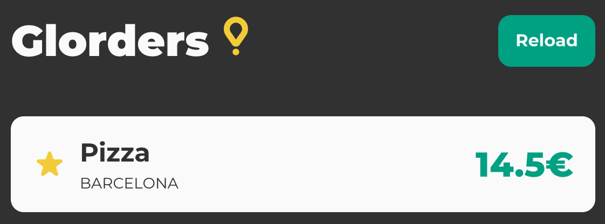

# Glorders

Welcome to the Frontend Live Coding Interview's base project!

This imaginary hobby web app was meant to be used by internal employees to check their previous Glovo orders (hence its name, Glorders). The orders are coming from our mock, internal API.

## Description

Your Product Manager really liked this project and decided to promote it into our webapp. Your overall goal is to improve all the existing functionalities until you think that it

- could seamlessly serve our production traffic
- could be easily extended and maintained by our Frontend Engineers

### Tech Stack

- [Vite](https://vitejs.dev/), a super fast development server to provide the quickest experience
- HTML, CSS, and JavaScript using [Document API](https://developer.mozilla.org/en-US/docs/Web/API/Document) (TypeScript is supported out-of-the-box but not required)
- A [simple CSS reset](https://tailwindcss.com/docs/preflight) to get rid of browsers’ default styling
- [Jest](https://jestjs.io) and [Testing Library DOM](https://testing-library.com/docs/) for testing

## Tasks

1. Walk through the project and share your thoughts with us (could be anything related to HTML, CSS, or JavaScript). If you find some quick wins, feel free to refactor.

2. Implement the missing reload functionality. After you click on the _Reload_ button, it should refetch the data from the API and rerender the list. Make sure to cover the functionality with unit tests!

3. The PM decided to spice up the things and asked you to sort the orders based on their `price`, using alternating sort.

   **Example**

   ```
   e[0] ≤ e[1] ≥ e[2] ≤ e[3] ≥ e[4] ..

   The elements in e need not be unique (they may be repeated)

   For example:

   5 2 1 7 9 8 ->  1 ≤ 7 ≥ 5 ≤ 9 ≥ 2 ≤ 8  or  2 ≤ 5 ≥ 1 ≤ 9 ≥ 7 ≤ 8 or ...

   1 2 3 4 5 6 ->  1 ≤ 3 ≥ 2 ≤ 5 ≥ 4 ≤ 6  or ...

   -2 3 3 -3   ->  3 ≤ 3 ≥ -3 ≤ -2  or  -2 ≤ 3 ≥ -3 ≤ 3 or ...
   ```

4. The UI designer extended the list item with an option to display whether your order was favored or not. Make sure to update the UI using the icon `./assets/star.svg`. Similarly like
   

## Useful commands

### `yarn install` or `npm install`

Install dependencies with package manager.

### `yarn dev` or `npm run dev`

Run the app in the development mode.
Open [http://localhost:3000](http://localhost:3000) to view it in the browser.

The page will reload if you make edits.

### `yarn test` or `npm run test`

Launch the test runner.
